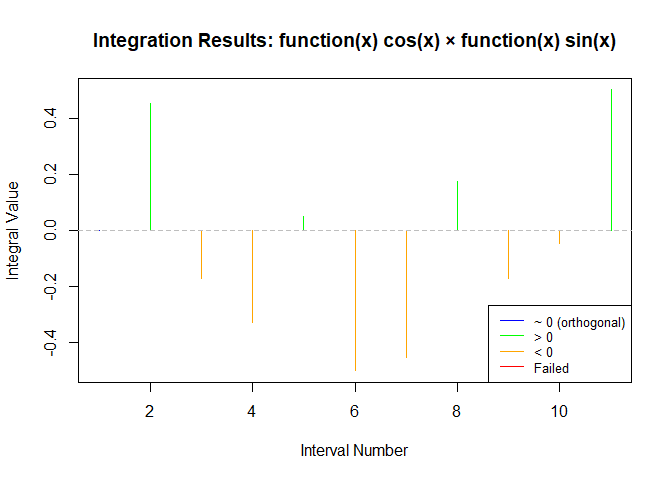
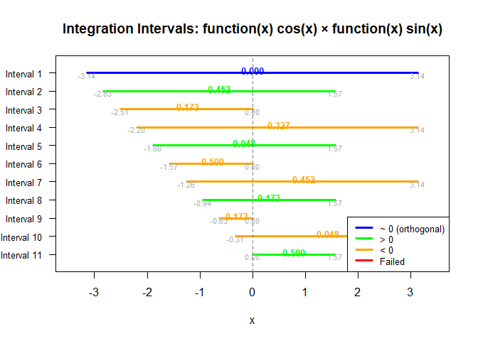

<!-- README.md is generated from README.Rmd. Please edit that file -->

# orthinto

<!-- badges: start -->

<!-- badges: end -->

The goal of orthinto is to explore integrals of orthogonal functions.

## Installation

You can install the development version of orthinto from
[GitHub](https://github.com/) with:

``` r
# install.packages("pak")
pak::pak("mightymetrika/orthinto")
```

## Orthogonal Example

``` r
library(orthinto)

oio <- orthinto(phi = function(x) cos(x),
                psi = function(x) sin(x),
                dl = seq(-pi, 0, pi/10),
                du = seq(pi, 0, -pi/10))

summary(oio)
#> Orthogonal Integration Summary
#> =============================
#> Functions: function(x) cos(x) × function(x) sin(x) 
#> Number of intervals: 11 
#> 
#> Integration Values:
#>   Min: 0.000000 
#>   Max: 0.000000 
#>   Mean: 0.000000 
#>   Sum: 0.000000 
#> 
#> Absolute Errors:
#>   Min: 0.00e+00 
#>   Max: 2.21e-14 
#>   Mean: 1.10e-14 
#> 
#> Orthogonality Assessment:
#>   Total integral: 0.000000 
#>   Assessment: Functions appear to be orthogonal (integral ≈ 0)
plot(oio)
```


``` r
plot(oio, type = "bounds")
```


## Non-orthogonal Example

``` r

noio <- orthinto(phi = function(x) cos(x),
                psi = function(x) sin(x),
                dl = seq(-pi, 0, pi/10),
                du = seq(pi, 0, -pi/2))

summary(noio)
#> Orthogonal Integration Summary
#> =============================
#> Functions: function(x) cos(x) × function(x) sin(x) 
#> Number of intervals: 11 
#> 
#> Integration Values:
#>   Min: -0.500000 
#>   Max: 0.500000 
#>   Mean: -0.045455 
#>   Sum: -0.500000 
#> 
#> Absolute Errors:
#>   Min: 1.92e-15 
#>   Max: 1.36e-11 
#>   Mean: 1.25e-12 
#> 
#> Orthogonality Assessment:
#>   Total integral: -0.500000 
#>   Assessment: Functions do not appear to be orthogonal
plot(noio)
```



``` r
plot(noio, type = "bounds")
```



## Mixed Example

``` r
moio <- orthinto(phi = function(x) x,
                 psi = function(x) x^3 - (3*(pi^2)/5)*x,
                 dl = seq(-4*pi, 0, by = pi) ,
                 du = seq( 4*pi, 0, by = -pi))

summary(moio)
#> Orthogonal Integration Summary
#> =============================
#> Functions: function(x) x × function(x) x^3 - (3 * (pi^2)/5) * x 
#> Number of intervals: 5 
#> 
#> Integration Values:
#>   Min: 0.000000 
#>   Max: 117511.558958 
#>   Mean: 29377.889739 
#>   Sum: 146889.448697 
#> 
#> Absolute Errors:
#>   Min: 0.00e+00 
#>   Max: 1.31e-09 
#>   Mean: 3.27e-10 
#> 
#> Orthogonality Assessment:
#>   Total integral: 146889.448697 
#>   Assessment: Functions do not appear to be orthogonal
plot(moio)
```


``` r
plot(moio, type = "bounds")
```


